```{r setup, include=FALSE}
knitr::opts_chunk$set(
  echo = TRUE,
  message = FALSE,
  warning = FALSE,
  fig.align = "center",
  fig.width = 5,
  fig.height = 3.6,
  out.width = "70%"
)

# All chunks below assume the working directory is this file's location
# (report/), which is knitr's default behaviour when rendering an .Rmd file.
library(ggplot2)
library(dplyr)
library(car)
library(lmtest)
library(plm)
library(knitr)
library(kableExtra)

source("../R/diag_lm_class.R")
source("../R/simulate_data.R")
```

```{=latex}
\clearpage
\tableofcontents
\clearpage
```

# Introduction

## Motivation

The Classical Linear Regression Model (CLRM) estimated by Ordinary Least
Squares relies on a small set of Gauss--Markov assumptions (linearity,
strict exogeneity, homoskedasticity, no serial correlation and no perfect
multicollinearity) for its estimator to be the Best Linear Unbiased Estimator
(BLUE), and on normality of the errors for small-sample inference (t- and
F-tests) to be exact [@gujarati2009; @wooldridge2020]. In applied work,
violations of these assumptions are common and, if undetected, can lead to
inefficient estimates, biased standard errors and misleading hypothesis
tests. Manually checking each assumption for every model specification is
repetitive and error-prone, which motivates encapsulating the checks inside a
reusable software abstraction.

## Objectives

This project has four objectives:

1. **Encapsulate diagnostic logic** in a single, well-tested S3 class
   (`diag_lm`) that separates statistical computation from presentation,
   following the classic R idiom of `print`/`summary`/`plot` methods.
2. **Extend the diagnostic framework beyond the linear model** to binomial
   logistic regression, since a binary outcome violates the assumptions that
   Breusch--Pagan, Durbin--Watson and Shapiro--Wilk are built on and
   therefore requires a different diagnostic toolkit (goodness-of-fit,
   discrimination and calibration checks) rather than a reuse of the linear
   ones.
3. **Provide an interactive front end** (`app.R`, a `shiny` dashboard)
   so that a non-technical user can choose a model family, simulate data with
   known assumption violations or upload their own data, and immediately see
   whether an assumption is violated, through a diagnostic display that is
   curated to the model family and data structure actually selected (e.g.
   time-series users are shown serial-correlation-relevant plots rather than
   the fitted-value-based plots designed for cross-sectional heteroskedasticity).
4. **Validate the implementation** through (a) a controlled simulation study
   where the ground truth is known by construction for both model families,
   (b) applied case studies on real survey data and (c) an automated
   regression test suite.

## Report Roadmap

Section 2 describes the software architecture. Section 3 reviews the
statistical methodology behind each diagnostic test, for both model families.
Section 4 presents the simulation study. Section 5 presents real-world case
studies. Section 6 documents the `shiny` application. Section 7 summarises
automated testing and validation. Section 8 discusses limitations and future
work, and Section 9 concludes. Appendix A describes the variables used in
the report's real and simulated datasets, and Appendix B provides the
vignette-style usage guide.

# Software Architecture

## Project Structure

The project is organised as a set of R scripts rather than a formally
installable package (there is no `DESCRIPTION` or `NAMESPACE` file). The
layout is:

```
Project/
+-- app.R                # Shiny app (UI + server), the sole application
+-- R/
|   +-- diag_lm_class.R       # diag_lm S3 class: constructor + print/summary/plot methods
|   +-- simulate_data.R       # simulate_ols_data() / simulate_ts_data() / simulate_logit_data()
|   +-- llm_interpret.R       # optional, opt-in AI-assisted interpretation via Groq (Section 6.1)
+-- data/
|   +-- sample_cars.csv, wage.csv, srental.csv, titanic.csv
+-- tests/
|   +-- test_diag_lm.R        # smoke tests for the diag_lm class (linear and logistic)
|   +-- test_app_server.R     # shiny::testServer() integration tests for app.R
+-- report/
    +-- Report.Rmd            # this report (rmarkdown source)
    +-- references.bib        # bibliography
    +-- figures/              # screenshots used in Section 6
```

Because the project comprises scripts rather than a package, the equivalent
of package "documentation in a vignette" is provided narratively throughout
this report and, in full tutorial form, in Appendix B.

## The `diag_lm` S3 Class

`diag_lm` is a lightweight container class built with R's S3 object system.
The constructor, `new_diag_lm(model, data_type)`, accepts a fitted `lm`,
`plm` or binomial `glm` object and:

1. validates the input against the requested `data_type`: `"logistic"`
   (alias `"binary"`) requires a `glm(family = binomial(...))` object, while
   `"cross-section"`, `"time-series"` and `"panel"` require an `lm`/`plm`
   object, stopping early with an informative error otherwise;
2. stores the model formula, coefficient table, residuals and fitted
   values;
3. for linear models, computes, wrapped in `tryCatch()` so that failures
   degrade to `NA` rather than crashing the app: the Breusch--Pagan
   statistic (`lmtest::bptest`), the Durbin--Watson statistic
   (`lmtest::dwtest`), the Shapiro--Wilk statistic (`shapiro.test`) and the
   Variance Inflation Factors (`car::vif`, which is undefined for
   single-predictor models);
4. for logistic models, computes instead the Hosmer--Lemeshow
   goodness-of-fit test, McFadden/Cox--Snell/Nagelkerke pseudo-$R^2$
   measures, the AUC, confusion-matrix accuracy/sensitivity/specificity and
   a (quasi-)complete-separation flag, all implemented in base R (no
   additional package dependency) so that the framework remains lightweight;
5. for time-series (`data_type = "time-series"`) or panel
   (`data_type = "panel"`) linear models, additionally computes the
   Breusch--Godfrey and Ljung--Box tests, or the panel Breusch--Pagan
   (Lagrange Multiplier) and Hausman tests, respectively; VIF is computed
   for logistic models too, since it remains well defined for any
   design matrix regardless of the response family.

Table 1 summarises the public interface.

```{r s3-methods-table, echo=FALSE}
methods_tbl <- data.frame(
  Function = c("new_diag_lm(model, data_type)",
               "print.diag_lm(x)",
               "summary.diag_lm(object)",
               "plot.diag_lm(x, type)",
               "remediation_advice(object)"),
  Returns = c("diag_lm object", "console text", "gt table",
              "ggplot object", "character vector (HTML)"),
  Purpose = c(
    "Constructor: validates input, fits the appropriate diagnostics",
    "Compact console overview of formula, coefficients, diagnostics",
    "Formatted table adapted to cross-section / time-series / panel / logistic layout",
    "One of residuals, qq, scale_location, histogram, acf, pacf, residuals_time (linear); binned_residuals, roc, calibration (logistic)",
    "Rule-based, p-value-driven remediation messages"
  )
)
kbl(methods_tbl, caption = "Public interface of the diag\\_lm class",
    booktabs = TRUE, linesep = "") |>
  kable_styling(latex_options = c("hold_position"), font_size = 9) |>
  column_spec(1, width = "4.3cm") |>
  column_spec(2, width = "2.6cm") |>
  column_spec(3, width = "7.6cm")
```

## The Simulation Engine

`R/simulate_data.R` provides three data-generating processes used throughout
this report and inside the `shiny` app itself:

- `simulate_ols_data(n, heteroskedastic, multicollinear, seed)` draws a
  cross-sectional sample from
  $$Y_i = 10 + 2.5\,X_{1i} - 1.5\,X_{2i} + \varepsilon_i,$$
  optionally scaling $\mathrm{sd}(\varepsilon_i) = 1 + 1.5|X_{1i}|$
  (heteroskedastic) and/or setting $X_{2i} = X_{1i} + \eta_i$ with small
  $\eta_i$ (multicollinear).
- `simulate_ts_data(n, heteroskedastic, multicollinear, seed, phi)` generates
  the same linear model but with AR(1)-persistent predictors and an AR(1)
  error process $e_t = \phi e_{t-1} + \nu_t$, inducing genuine serial
  correlation for the time-series diagnostics to detect.
- `simulate_logit_data(n, multicollinear, nonlinear, imbalance, seed)` draws
  a binary outcome from
  $$Y_i \sim \text{Bernoulli}\big(\operatorname{logit}^{-1}(\eta_i)\big), \qquad
    \eta_i = 1.4\,X_{1i} - 1.1\,X_{2i},$$
  with three optional violations: `multicollinear` correlates $X_2$ with
  $X_1$; `nonlinear` adds an omitted $0.6\,X_1^2$ term to $\eta_i$ so the
  fitted linear-in-the-logit model is mis-specified; and `imbalance` shifts
  the intercept to produce a rare positive class ($\approx 10\%$).

Because the ground truth is known by construction, these generators let us
validate that the diagnostic tests behave as theory predicts (Section 4).

## The Shiny Application

`app.R` is the sole application in the project. Its server function
keeps almost no statistical logic of its own: it maps UI inputs, including
a **Model Family** selector
(Linear/OLS vs. Logistic/Binomial), to `simulate_ols_data()` /
`simulate_ts_data()` / `simulate_logit_data()`, a bundled "available" wage
dataset or an uploaded CSV; builds a model formula from the selected
outcome/predictor columns (optionally with interaction terms); fits `lm()`,
`plm()` or `glm(family = binomial())` depending on the selected family and
data structure; wraps the result in `new_diag_lm()`; and renders the
`summary()` / `plot()` outputs. Three design choices deserve emphasis:

- **Family- and structure-aware diagnostics.** The "Assumptions Check" value
  boxes and the diagnostic-plot grid are both generated by `renderUI()`
  functions that inspect the selected model family and data structure and
  render only the diagnostics that are statistically meaningful for that
  combination, e.g. Hosmer--Lemeshow/AUC/Accuracy value boxes and
  binned-residual/ROC/calibration plots for logistic models, or
  residuals-over-time/ACF/PACF plots (instead of the fitted-value-based
  Residuals-vs-Fitted and Scale-Location plots) for time series, since those
  two plots target heteroskedasticity rather than serial correlation.
- `eventReactive(input$sim_btn, ..., ignoreNULL = FALSE)` regenerates
  simulated data only when the user clicks "Simulate & Load Framework" (so
  dragging the sample-size slider does not silently refit the model), while
  `ignoreNULL = FALSE` ensures the app is populated on first load.
- `req()` guards and `validate(need(...))` messages turn missing-input and
  malformed-CSV situations into friendly in-app messages instead of red
  Shiny error tracebacks.

# Statistical Methodology

This section summarises the theory behind each diagnostic implemented in
`diag_lm`.

## Heteroskedasticity: The Breusch--Pagan Test

The CLRM assumes constant error variance, $\mathrm{Var}(\varepsilon_i) =
\sigma^2$ for all $i$. The Breusch--Pagan test [@breuschpagan1979] regresses
the squared OLS residuals on the original regressors and tests whether they
explain any of the variation in $\hat\varepsilon_i^2$:
$$\hat\varepsilon_i^2 = \gamma_0 + \gamma_1 X_{1i} + \dots + \gamma_k X_{ki} + v_i.$$
The test statistic is $BP = n R^2_{\text{aux}}$, which is asymptotically
$\chi^2_k$ under the null of homoskedasticity. A small p-value
($< 0.05$) is evidence of heteroskedasticity, which does not bias
$\hat\beta$ but invalidates the usual OLS standard errors, the standard
remedy is heteroskedasticity-robust (White) standard errors.

## Serial Correlation: Durbin--Watson, Breusch--Godfrey and Ljung--Box

For cross-sectional data, `diag_lm` reports the Durbin--Watson statistic
[@durbinwatson1950; @durbinwatson1951],
$$DW = \frac{\sum_{t=2}^{n}(\hat\varepsilon_t - \hat\varepsilon_{t-1})^2}{\sum_{t=1}^{n}\hat\varepsilon_t^2} \approx 2(1-\hat\rho),$$
where $\hat\rho$ is the estimated first-order autocorrelation of the
residuals; $DW \approx 2$ indicates no serial correlation. For time-series
data, `diag_lm` additionally reports the Breusch--Godfrey test
[@godfrey1978], which generalises Durbin--Watson to higher-order
autocorrelation and remains valid with lagged dependent variables, and the
Ljung--Box portmanteau test [@ljungbox1978] on the residual autocorrelation
function.

**Why the diagnostic plots differ for time series.** Residuals-vs-Fitted and
Scale-Location are constructed against the *fitted value* and are designed to
reveal heteroskedasticity or non-linearity; neither can display serial
structure, because that structure is indexed by *time*, not by the fitted
value. `diag_lm` therefore also offers a Residuals-over-Time plot (residuals
against their time index, the direct visual analogue of the Breusch--Godfrey
and Ljung--Box tests) and a Partial Autocorrelation (PACF) plot alongside the
standard ACF plot, so that the order of any remaining autocorrelation can be
read off directly. `app.R` (Section 6) surfaces exactly this curated set:
Residuals-over-Time, ACF, PACF, Normal Q-Q and Residual Histogram, when
the user selects time-series data, rather than reusing the cross-sectional
plot menu.

## Normality: The Shapiro--Wilk Test

Small-sample $t$/$F$ inference relies on normally distributed errors. The
Shapiro--Wilk test [@shapirowilk1965] compares the ordered residuals against
the order statistics expected under normality; a small p-value rejects
normality. Coefficient estimates remain unbiased under non-normality (by the
Gauss--Markov theorem, which does not require normality), but small-sample
hypothesis tests become unreliable.

## Multicollinearity: The Variance Inflation Factor

Multicollinearity inflates the variance of $\hat\beta_j$ without biasing it.
The Variance Inflation Factor for predictor $j$ [@foxweisberg2019] is
$$VIF_j = \frac{1}{1 - R_j^2},$$
where $R_j^2$ is the $R^2$ from regressing $X_j$ on all other predictors.
$VIF_j \approx 1$ indicates no collinearity; a common rule of thumb flags
$VIF_j > 5$ (or 10) as problematic. VIF is undefined for single-predictor
models, so `new_diag_lm()` returns `NA` in that case rather than raising an
error.

## Logistic Regression Diagnostics

A binary outcome violates the assumptions that Breusch--Pagan,
Durbin--Watson and Shapiro--Wilk are built on: the response is not
continuous, its conditional variance is $p_i(1-p_i)$ by construction rather
than a constant $\sigma^2$ and its residuals are never normally distributed.
When `data_type = "logistic"`, `diag_lm` therefore substitutes a different
toolkit, all implemented in base R without additional package dependencies.

**Goodness-of-fit: the Hosmer--Lemeshow test.** The Hosmer--Lemeshow test
[@hosmerlemeshow1980; @hosmerlemeshow2013] groups observations into $g$ (here
$g=10$) bins of increasing predicted probability and compares observed
versus expected successes and failures within each bin:
$$HL = \sum_{k=1}^{g} \left[ \frac{(O_{1k}-E_{1k})^2}{E_{1k}} + \frac{(O_{0k}-E_{0k})^2}{E_{0k}} \right],$$
which is asymptotically $\chi^2_{g-2}$ under the null hypothesis that the
fitted model is correctly specified. A small p-value indicates poor fit,
typically a sign of omitted non-linearity or missing predictors.

**Pseudo-$R^2$ measures.** Because logistic regression is fit by maximum
likelihood rather than least squares, no direct analogue of the OLS $R^2$
exists. `diag_lm` reports three commonly used approximations, all computed
from the fitted log-likelihood $\ell_{\text{model}}$ and the log-likelihood
of an intercept-only null model $\ell_{\text{null}}$: McFadden's
[@mcfadden1974] $R^2_{\text{McF}} = 1 - \ell_{\text{model}}/\ell_{\text{null}}$;
Cox--Snell's [@coxsnell1989]
$R^2_{\text{CS}} = 1 - \exp\{(2/n)(\ell_{\text{null}}-\ell_{\text{model}})\}$;
and Nagelkerke's [@nagelkerke1991] rescaled version
$R^2_{\text{Nag}} = R^2_{\text{CS}} / (1 - \exp\{(2/n)\ell_{\text{null}}\})$,
which stretches $R^2_{\text{CS}}$ so that it can reach 1.

**Discrimination: the ROC curve and AUC.** The Area Under the Receiver
Operating Characteristic curve [@hanleymcneil1982] summarises how well the
fitted probabilities separate the two classes across every possible decision
threshold; `diag_lm` computes it via the equivalent Mann--Whitney $U$
statistic, $AUC = U / (n_1 n_0)$, where $n_1, n_0$ are the numbers of
positive and negative cases. $AUC = 0.5$ is chance-level discrimination and
$AUC = 1$ is perfect separation; a common rule of thumb treats
$AUC \geq 0.8$ as good and $AUC < 0.7$ as weak.

**Calibration and classification.** The binned residual plot bins
observations by predicted probability and compares the average *response*
residual ($Y_i - \hat p_i$) per bin against an approximate
$\pm 2\sqrt{\bar p(1-\bar p)/n_{\text{bin}}}$ band, while the calibration
plot compares mean predicted probability against the observed proportion of
successes per bin; both should track the identity line if the model is
well-calibrated. `diag_lm` also reports accuracy, sensitivity, and
specificity from the confusion matrix at the conventional 0.5 threshold.

**Separation.** When a predictor (or combination of predictors) perfectly or
quasi-perfectly separates the two classes, maximum-likelihood estimates do
not exist and standard errors diverge [@albertanderson1984]. `diag_lm` flags
this with a simple heuristic (implausibly large standard errors) and
`remediation_advice()` recommends Firth's penalised-likelihood correction
[@firth1993] as a standard remedy.

## Panel-Specific Diagnostics

When `data_type = "panel"`, `diag_lm` additionally fits within (fixed
effects) and random-effects companions to the supplied pooling model and
reports the panel Breusch--Pagan Lagrange Multiplier test for the presence of
individual effects, and the Hausman specification test [@hausman1978] for
choosing between fixed and random effects (a significant Hausman test favours
fixed effects).

\newpage

# Simulation Study

This section validates the software against data where the presence or
absence of each assumption violation is known by construction, using the
generators in `R/simulate_data.R` and the same `diag_lm` pipeline used inside
the app. Sections 4.1--4.5 cover the linear model; Sections 4.6--4.9 cover
the logistic extension.

## Baseline: No Violations

```{r sim-baseline}
set.seed(101)
df_base <- simulate_ols_data(n = 400, heteroskedastic = FALSE, multicollinear = FALSE)
fit_base <- lm(Y ~ X1 + X2, data = df_base)
diag_base <- new_diag_lm(fit_base, data_type = "cs")

kable(round(diag_base$coefficients, 4), caption = "Baseline model: OLS coefficients")
```

```{r sim-baseline-diag, echo=FALSE}
base_tbl <- data.frame(
  Test = c("Breusch-Pagan (heteroskedasticity)", "Durbin-Watson (serial correlation)",
           "Shapiro-Wilk (normality)", "Max VIF (multicollinearity)"),
  Statistic = c(round(diag_base$diagnostics$bp_statistic, 3),
                round(diag_base$diagnostics$dw_statistic, 3),
                NA,
                round(max(diag_base$diagnostics$vif_scores), 3)),
  `p-value` = c(round(diag_base$diagnostics$bp_pvalue, 4),
                round(diag_base$diagnostics$dw_pvalue, 4),
                round(diag_base$diagnostics$shapiro_pvalue, 4),
                NA),
  check.names = FALSE
)
kable(base_tbl, caption = "Baseline model: assumption diagnostics (no violation injected)")
```

```{r sim-baseline-plots, fig.show='hold', out.width='49%', fig.cap="Baseline model: Residuals vs Fitted (left) and Normal Q-Q (right). No funnel shape and points close to the diagonal are consistent with homoskedastic, approximately normal errors."}
print(plot(diag_base, type = "residuals"))
print(plot(diag_base, type = "qq"))
```

All four p-values sit comfortably above 0.05 and the maximum VIF stays close
to 1, so none of the checks raises a flag here, exactly what one would
expect when no violation has been injected into the data-generating process.

## Injected Heteroskedasticity

```{r sim-het}
set.seed(102)
df_het <- simulate_ols_data(n = 400, heteroskedastic = TRUE, multicollinear = FALSE)
fit_het <- lm(Y ~ X1 + X2, data = df_het)
diag_het <- new_diag_lm(fit_het, data_type = "cs")
cat(sprintf("Breusch-Pagan p-value: %.5f\n", diag_het$diagnostics$bp_pvalue))
```

```{r sim-het-plot, fig.cap="Residuals vs Fitted under injected heteroskedasticity: the funnel-shaped spread of residuals is the classic visual signature that the Breusch-Pagan test also detects numerically."}
print(plot(diag_het, type = "residuals"))
```

Once `heteroskedastic = TRUE` is switched on, the Breusch--Pagan p-value
falls sharply, typically well below 0.05, and the residual plot develops
the expected funnel shape. Numerical test and visual diagnostic point to the
same conclusion.

## Injected Multicollinearity

```{r sim-collinear}
set.seed(103)
df_col <- simulate_ols_data(n = 400, heteroskedastic = FALSE, multicollinear = TRUE)
fit_col <- lm(Y ~ X1 + X2, data = df_col)
diag_col <- new_diag_lm(fit_col, data_type = "cs")
kable(round(as.data.frame(t(diag_col$diagnostics$vif_scores)), 2),
      caption = "VIF scores under injected multicollinearity")
cat(sprintf("Correlation(X1, X2) = %.3f\n", cor(df_col$X1, df_col$X2)))
```

Because `multicollinear = TRUE` constructs $X_2$ as $X_1$ plus a small noise
term, the correlation between the two predictors approaches 1, and both
VIFs climb well past the conventional threshold of 5, harmful collinearity
is flagged correctly.

## Comparison Across Scenarios

```{r sim-comparison, echo=FALSE}
comparison_tbl <- data.frame(
  Scenario = c("Baseline", "Heteroskedastic", "Multicollinear"),
  BP_pvalue = c(diag_base$diagnostics$bp_pvalue, diag_het$diagnostics$bp_pvalue, diag_col$diagnostics$bp_pvalue),
  Max_VIF = c(max(diag_base$diagnostics$vif_scores), max(diag_het$diagnostics$vif_scores), max(diag_col$diagnostics$vif_scores)),
  Shapiro_pvalue = c(diag_base$diagnostics$shapiro_pvalue, diag_het$diagnostics$shapiro_pvalue, diag_col$diagnostics$shapiro_pvalue)
)
comparison_tbl[,2:4] <- round(comparison_tbl[,2:4], 4)
kable(comparison_tbl, caption = "Diagnostic summary across the three simulated scenarios")
```

The comparison table makes the selectivity explicit: each violation moves
only the diagnostic built to detect it, leaving the other columns close to
their baseline values. That is the property worth demonstrating: a
diagnostic suite should be specific, not merely sensitive.

## Time-Series Data: Serial Correlation

```{r sim-ts}
set.seed(104)
df_ts <- simulate_ts_data(n = 300, heteroskedastic = FALSE, multicollinear = FALSE, phi = 0.6)
fit_ts <- lm(Y ~ X1 + X2, data = df_ts)
diag_ts <- new_diag_lm(fit_ts, data_type = "ts")
cat(sprintf("Breusch-Godfrey p-value: %.5f\n", diag_ts$diagnostics$ts$bg_pvalue))
cat(sprintf("Ljung-Box p-value:      %.5f\n", diag_ts$diagnostics$ts$ljung_box_pvalue))
```

```{r sim-ts-plot, fig.show='hold', out.width='49%', fig.cap="Residuals over time (left) and residual ACF (right) for the AR(1)-simulated time series (phi = 0.6). The persistent, slowly-decaying pattern in both views is the signature of genuine serial correlation, consistent with the significant Breusch-Godfrey and Ljung-Box p-values above; this is the curated pair the app now shows for time-series data instead of the fitted-value-based Residuals-vs-Fitted / Scale-Location plots."}
print(plot(diag_ts, type = "residuals_time"))
print(plot(diag_ts, type = "acf"))
```

```{r sim-ts-pacf, fig.cap="Residual PACF for the same series: a large spike at lag 1 that decays quickly is consistent with an AR(1) process, complementing the slow ACF decay by suggesting the order of the remaining serial correlation."}
print(plot(diag_ts, type = "pacf"))
```

Since the simulator injects an AR(1) error process with $\phi = 0.6$, both
the Breusch--Godfrey and Ljung--Box tests reject the null of no serial
correlation, and the ACF/PACF pair shows the pattern one would expect from a
low-order autoregressive process: a slowly decaying ACF alongside a PACF
that cuts off sharply after the first lag.

## Logistic Baseline: No Violations

```{r sim-logit-baseline}
set.seed(201)
df_lbase <- simulate_logit_data(n = 500, multicollinear = FALSE, nonlinear = FALSE, imbalance = FALSE)
fit_lbase <- glm(Y ~ X1 + X2, data = df_lbase, family = binomial())
diag_lbase <- new_diag_lm(fit_lbase, data_type = "logistic")

kable(round(diag_lbase$coefficients, 4), caption = "Logistic baseline model: coefficient estimates")
```

```{r sim-logit-baseline-diag, echo=FALSE}
lbase_tbl <- data.frame(
  Test = c("Hosmer-Lemeshow (goodness-of-fit)", "McFadden pseudo-R2",
           "AUC (discrimination)", "Accuracy at 0.5 cutoff", "Max VIF (multicollinearity)"),
  Value = c(round(diag_lbase$diagnostics$logistic$hl_pvalue, 4),
            round(diag_lbase$diagnostics$logistic$mcfadden_r2, 4),
            round(diag_lbase$diagnostics$logistic$auc, 4),
            round(diag_lbase$diagnostics$logistic$accuracy, 4),
            round(max(diag_lbase$diagnostics$vif_scores), 3))
)
kable(lbase_tbl, caption = "Logistic baseline model: diagnostics (no violation injected)")
```

```{r sim-logit-baseline-plots, fig.show='hold', out.width='32%', fig.height=3, fig.cap="Logistic baseline model: Binned Residual plot (left), ROC curve (centre) and Calibration plot (right). Residuals scattered around zero within the approximate band, a ROC curve well above the diagonal and points tracking the identity line are all consistent with a correctly specified, well-discriminating, well-calibrated model."}
print(plot(diag_lbase, type = "binned_residuals"))
print(plot(diag_lbase, type = "roc"))
print(plot(diag_lbase, type = "calibration"))
```

None of the three diagnostics raises a concern here: the Hosmer--Lemeshow
test does not reject adequate fit, the AUC indicates good discrimination,
and both the binned-residual and calibration plots stay close to their
reference lines, consistent with a correctly specified model.

## Injected Omitted Non-Linearity (Mis-Specification)

```{r sim-logit-nonlinear}
set.seed(202)
df_lnl <- simulate_logit_data(n = 500, nonlinear = TRUE)
fit_lnl <- glm(Y ~ X1 + X2, data = df_lnl, family = binomial())
diag_lnl <- new_diag_lm(fit_lnl, data_type = "logistic")
cat(sprintf("Hosmer-Lemeshow p-value: %.6f\n", diag_lnl$diagnostics$logistic$hl_pvalue))
cat(sprintf("McFadden pseudo-R2:      %.4f\n", diag_lnl$diagnostics$logistic$mcfadden_r2))
```

```{r sim-logit-nonlinear-plot, fig.cap="Binned residual plot under an omitted quadratic term in X1: the systematic curvature away from zero, rather than a random scatter within the band, is the graphical counterpart of what the Hosmer-Lemeshow test flags numerically, a mis-specified functional form."}
print(plot(diag_lnl, type = "binned_residuals"))
```

Setting `nonlinear = TRUE` adds an omitted $0.6\,X_1^2$ term to the true
linear predictor that the fitted model (`Y ~ X1 + X2`) never sees. The
Hosmer--Lemeshow p-value falls sharply relative to the baseline, and the
binned residual plot loses its random scatter in favour of a systematic
curve: the numerical and graphical evidence for mis-specification point the
same way.

## Injected Multicollinearity and Class Imbalance

```{r sim-logit-viol}
set.seed(203)
df_lviol <- simulate_logit_data(n = 500, multicollinear = TRUE, imbalance = TRUE)
fit_lviol <- glm(Y ~ X1 + X2, data = df_lviol, family = binomial())
diag_lviol <- new_diag_lm(fit_lviol, data_type = "logistic")
kable(round(as.data.frame(t(diag_lviol$diagnostics$vif_scores)), 2),
      caption = "VIF scores under injected multicollinearity (logistic model)")
cat(sprintf("Positive-class proportion: %.3f\n", mean(df_lviol$Y)))
cat(sprintf("Separation flag: %s\n", diag_lviol$diagnostics$logistic$separation_flag))
```

Turning on `multicollinear = TRUE` pushes VIF well above the conventional
threshold of 5, just as in the linear case, confirming that the diagnostic
transfers unchanged to a binomial `glm`. Turning on `imbalance = TRUE`
instead pushes the positive-class proportion down to roughly 10%, a useful
reminder that accuracy alone is a poor discrimination metric once the
classes are unbalanced, and why `diag_lm` reports AUC and
sensitivity/specificity alongside it.

## Comparison Across Logistic Scenarios

```{r sim-logit-comparison, echo=FALSE}
logit_comparison_tbl <- data.frame(
  Scenario = c("Baseline", "Omitted non-linearity", "Multicollinear + imbalanced"),
  HL_pvalue = c(diag_lbase$diagnostics$logistic$hl_pvalue,
                diag_lnl$diagnostics$logistic$hl_pvalue,
                diag_lviol$diagnostics$logistic$hl_pvalue),
  AUC = c(diag_lbase$diagnostics$logistic$auc,
          diag_lnl$diagnostics$logistic$auc,
          diag_lviol$diagnostics$logistic$auc),
  Max_VIF = c(max(diag_lbase$diagnostics$vif_scores),
              max(diag_lnl$diagnostics$vif_scores),
              max(diag_lviol$diagnostics$vif_scores))
)
logit_comparison_tbl[, 2:4] <- round(logit_comparison_tbl[, 2:4], 4)
kable(logit_comparison_tbl, caption = "Diagnostic summary across the three simulated logistic scenarios")
```

As with the linear model, each injected violation is picked up by the
diagnostic designed to target it (Hosmer--Lemeshow for mis-specification,
VIF for multicollinearity), while AUC stays comparatively stable across
specifications, a reminder that discrimination is a logically distinct
property from specification or collinearity.

\newpage

# Case Study: Real-World Wage Data

To confirm the framework behaves sensibly on real data (not only simulations),
we apply it to `data/wage.csv`, a cross-sectional labour-economics dataset,
for both a linear and a logistic specification.

## Linear Case Study: Modelling Log Hourly Wage

```{r wage-load}
wage <- read.csv("../data/wage.csv")
cat(sprintf("Observations: %d | Variables: %d\n", nrow(wage), ncol(wage)))
str(wage[, c("wage", "experience", "age", "female", "univ")])
```

We regress log hourly wage on experience, age and an indicator for female,
a simple Mincer-style specification.

```{r wage-model}
wage$log_wage <- log(wage$wage)
fit_wage <- lm(log_wage ~ experience + age + female, data = wage)
diag_wage <- new_diag_lm(fit_wage, data_type = "cs")
kable(round(diag_wage$coefficients, 4), caption = "Wage regression: OLS coefficients")
```

```{r wage-diagnostics, echo=FALSE}
wage_tbl <- data.frame(
  Test = c("Breusch-Pagan", "Durbin-Watson", "Shapiro-Wilk", "Max VIF"),
  Value = c(
    sprintf("stat = %.3f, p = %.4f", diag_wage$diagnostics$bp_statistic, diag_wage$diagnostics$bp_pvalue),
    sprintf("stat = %.3f, p = %.4f", diag_wage$diagnostics$dw_statistic, diag_wage$diagnostics$dw_pvalue),
    sprintf("p = %.4f", diag_wage$diagnostics$shapiro_pvalue),
    sprintf("%.3f", max(diag_wage$diagnostics$vif_scores))
  )
)
kable(wage_tbl, caption = "Wage regression: assumption diagnostics")
```

```{r wage-plots, fig.show='hold', out.width='49%', fig.cap="Wage regression diagnostics: Residuals vs Fitted (left) and Normal Q-Q (right)."}
print(plot(diag_wage, type = "residuals"))
print(plot(diag_wage, type = "qq"))
```

```{r wage-remediation, results='asis', echo=FALSE}
advice <- remediation_advice(diag_wage)
if (length(advice) == 0) {
  cat("_No assumption violations were flagged for this specification._")
} else {
  cat(paste(gsub("<[^>]+>", "", advice), collapse = "\n\n"))
}
```

Real survey data on wages routinely departs from the idealised simulation
scenarios above (e.g. wages are typically right-skewed, which is why the
model is fit on the log scale here), illustrating why an automated diagnostic
layer is valuable in practice: a user can immediately see which assumptions
still warrant attention even after a standard transformation.

## Logistic Case Study: Predicting Sex from Labour-Market Characteristics

To exercise the logistic pathway on the same real dataset, we fit
`female` (a 0/1 indicator already present in `data/wage.csv`) on age and
experience, a purely illustrative specification chosen only to demonstrate
the diagnostic workflow on non-simulated data, not a substantive labour-
economics claim.

```{r wage-logit-model}
fit_wage_logit <- glm(female ~ age + experience, data = wage, family = binomial())
diag_wage_logit <- new_diag_lm(fit_wage_logit, data_type = "logistic")
kable(round(diag_wage_logit$coefficients, 4), caption = "Wage data logistic regression: coefficient estimates")
```

```{r wage-logit-diagnostics, echo=FALSE}
wage_logit_tbl <- data.frame(
  Test = c("Hosmer-Lemeshow", "McFadden pseudo-R2", "AUC", "Accuracy (0.5 cutoff)", "Max VIF"),
  Value = c(
    sprintf("p = %.4f", diag_wage_logit$diagnostics$logistic$hl_pvalue),
    sprintf("%.4f", diag_wage_logit$diagnostics$logistic$mcfadden_r2),
    sprintf("%.4f", diag_wage_logit$diagnostics$logistic$auc),
    sprintf("%.4f", diag_wage_logit$diagnostics$logistic$accuracy),
    sprintf("%.3f", max(diag_wage_logit$diagnostics$vif_scores))
  )
)
kable(wage_logit_tbl, caption = "Wage data logistic regression: diagnostics")
```

```{r wage-logit-plots, fig.show='hold', out.width='49%', fig.cap="Wage data logistic regression: ROC curve (left) and Binned Residual plot (right)."}
print(plot(diag_wage_logit, type = "roc"))
print(plot(diag_wage_logit, type = "binned_residuals"))
```

```{r wage-logit-remediation, results='asis', echo=FALSE}
advice_logit <- remediation_advice(diag_wage_logit)
if (length(advice_logit) == 0) {
  cat("_No assumption violations were flagged for this specification._")
} else {
  cat(paste(gsub("<[^>]+>", "", advice_logit), collapse = "\n\n"))
}
```

As expected for a weak, purely illustrative specification with only two
predictors, discrimination is modest; the case study nonetheless confirms
that the full logistic pipeline (fitting, all five diagnostics, three
plot types and rule-based remediation) runs end-to-end on real,
non-simulated survey data exactly as it does in the controlled simulations
of Section 4.

\newpage

# The Shiny Application

`app.R` is the primary application (Section 2.4) and presents the
workflow above through three tabs. **Setup** lets the user choose a **Model
Family** (Linear/OLS or Logistic/Binomial), a data source (simulate, a
bundled wage dataset or an uploaded CSV), and, for linear models, the
econometric structure (cross-section, time series or panel); it also hosts
an in-app variable-type editor. **Diagnostics** reports the fitted model,
colour-coded PASS/CHECK/CAUTION status indicators and a set of diagnostic
plots (both the value boxes and the plot grid are generated dynamically via
`renderUI()`) so that only diagnostics relevant to the selected model family
and data structure are shown (Section 2.4). **Transformation** supports
interaction-term construction and log/exp/square/standardise/log-return
column transforms. The screenshots below (captured live from a
`shiny::runApp()` session during the preparation of this report) show the
running application across the linear cross-sectional, logistic and
time-series pathways.

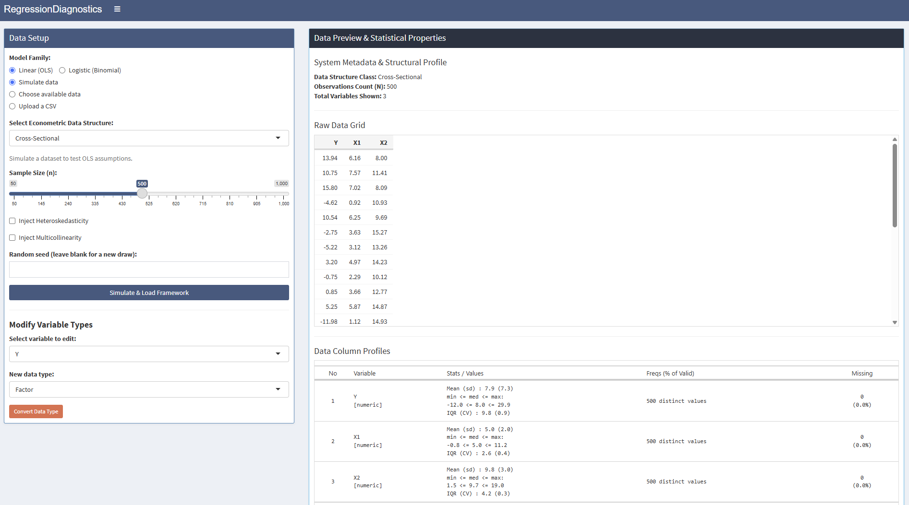

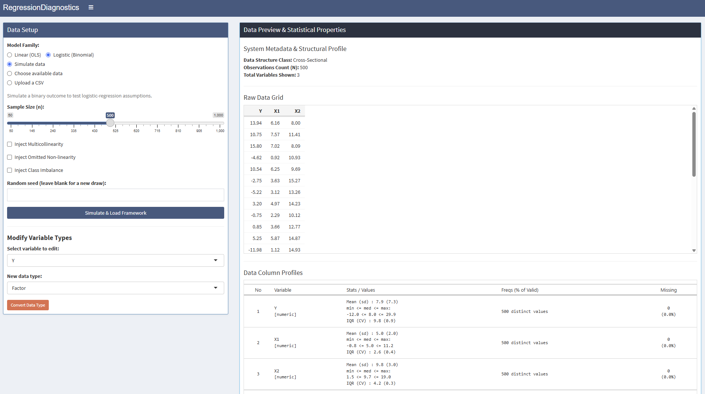

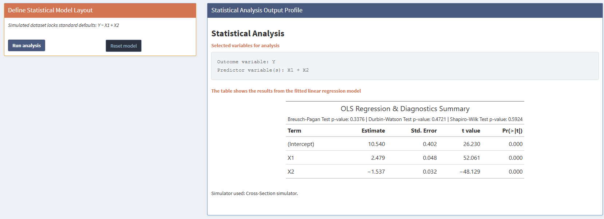

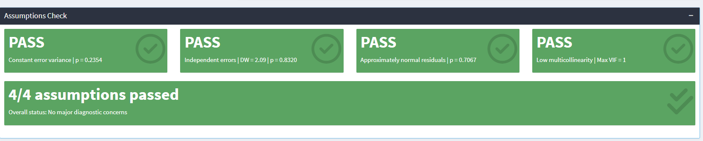

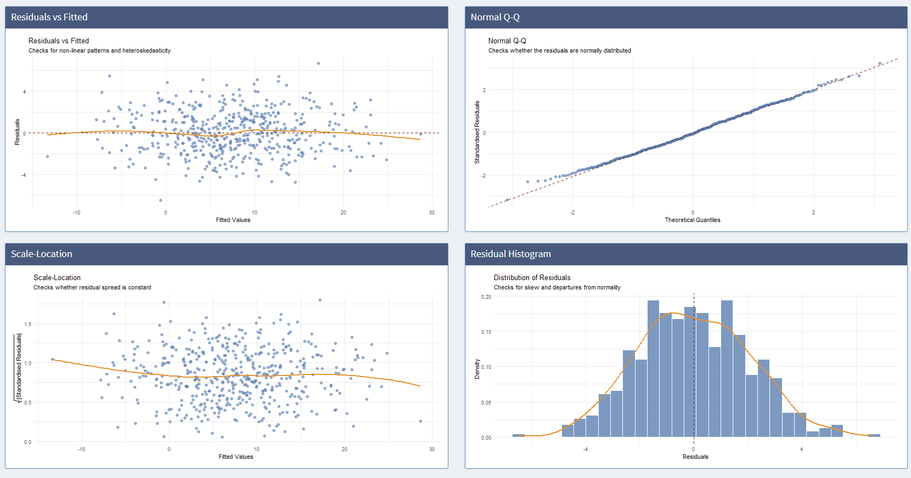

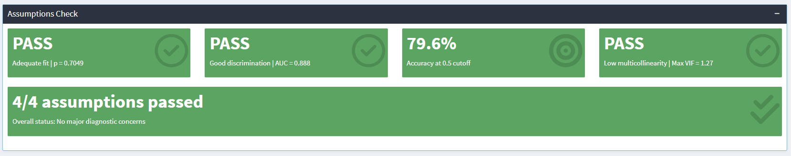

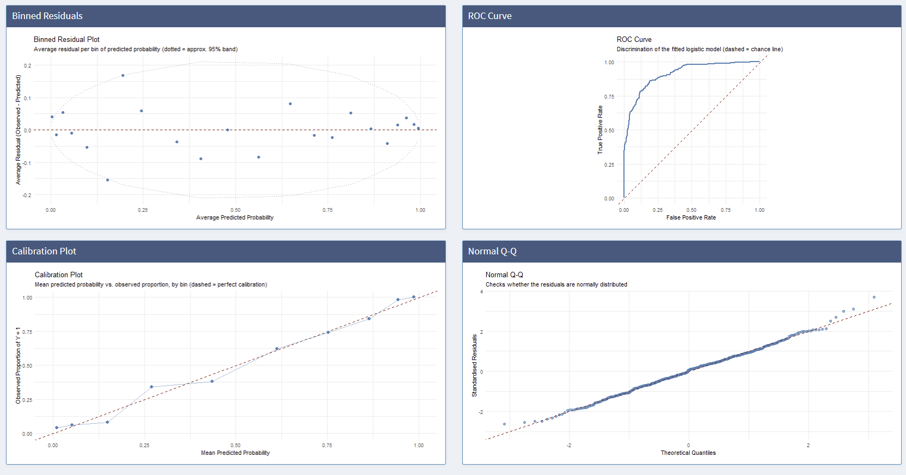

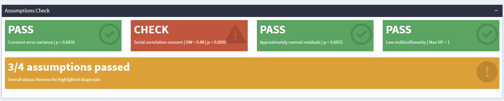

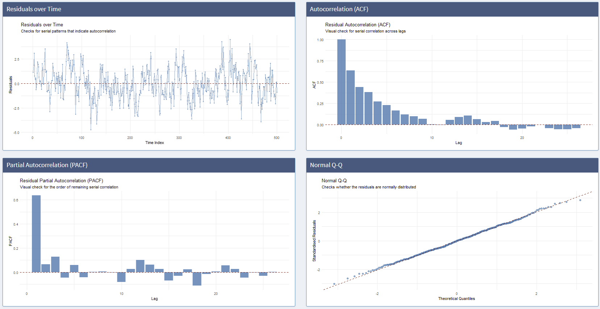

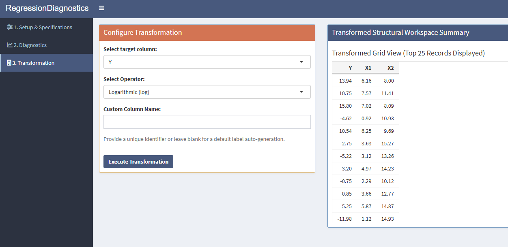

## AI-Assisted Interpretation (Optional, Opt-In)

The Diagnostics tab also offers an optional "AI Interpretation" panel,
implemented in `R/llm_interpret.R` and wired into `app.R` as a purely
additive feature that leaves every existing output untouched. Clicking
**Generate AI Interpretation** sends a compact, privacy-safe summary of the
*already-computed* diagnostic statistics (model type, coefficients and the
relevant test statistics/p-values, never raw data rows) to a third-party
large language model (Groq's `openai/gpt-oss-120b`, via its OpenAI-compatible
chat-completions API) and renders the model's plain-language narrative
alongside the deterministic, rule-based `remediation_advice()` output
(Section 2.2). The call is strictly opt-in: nothing is sent until the button
is clicked, and if no API key is configured the panel falls back to an
explanatory message instead of failing, so the deterministic parts of the
app and its reproducibility are unaffected whether or not this feature
is used. Because the response originates from an external service, it is
escaped and parsed through a Markdown-to-HTML pipeline (`commonmark`) before
display, so any stray HTML in the returned text is neutralised rather than
executed. This feature is disclosed here for transparency, consistent with
the use of an external AI service being permitted for this assignment.

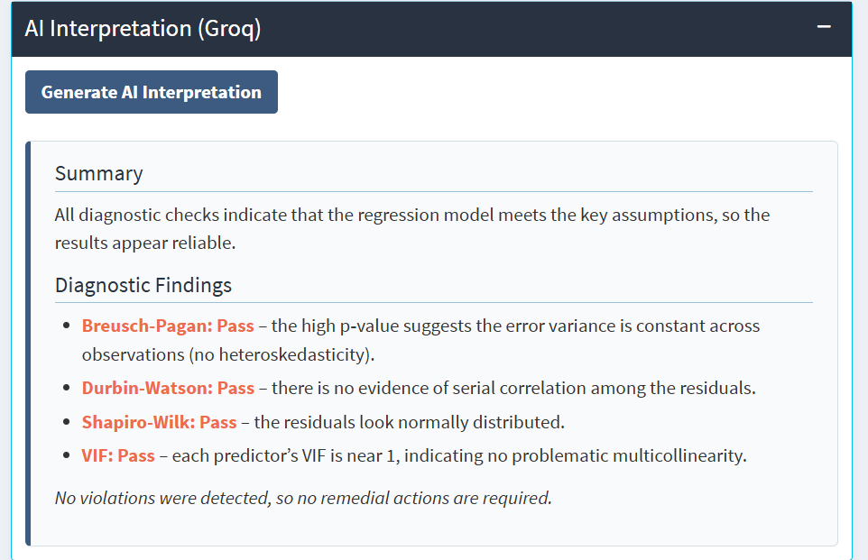

# Testing and Validation

## Unit-Level Tests of the `diag_lm` Class

`tests/test_diag_lm.R` is a lightweight, dependency-free smoke-test script
(not a `testthat` suite, consistent with the project not being a formal
package) that is executed below to demonstrate it passes as part of this
report's own reproducible build.

```{r run-tests, comment=""}
old_wd <- setwd("..")
source("tests/test_diag_lm.R")
setwd(old_wd)
```

The suite checks: (i) that `new_diag_lm()` returns an object of class
`diag_lm` for a valid multi-predictor model; (ii) that `summary()` returns a
`gt_tbl` object; (iii) that `plot()` returns a `ggplot` object for each
supported `type`, and raises an informative error for an unsupported type;
(iv) that VIF is correctly set to `NA` for a single-predictor model (where it
is mathematically undefined); (v) that the constructor rejects
non-`lm`/`plm` input with an explicit error; (vi) for the logistic
extension, that a binomial `glm` produces valid Hosmer--Lemeshow/AUC/McFadden
$R^2$ diagnostics, a `gt_tbl` summary and working `binned_residuals`/`roc`/
`calibration` plots; (vii) that those three logistic-only plot types raise an
informative error when requested on a non-logistic model; and (viii) that
the time-series-only `residuals_time`/`pacf` plot types render correctly.

## Shiny-Level Integration Tests of `app.R`

Unit tests on `diag_lm` alone do not exercise the reactive graph that
actually wires user input to model fitting and output rendering inside the
`shiny` app. To close that gap, the application underwent a structured QA
audit: the full server logic of `app.R` was mapped observer-by-observer
and reactive-by-reactive, and every input path (model family switches, data
upload vs. simulation, panel index selection, in-place type conversion) was
checked against its downstream consumers. This audit surfaced five concrete
defects, all of which were fixed in the current source (`app.R`, included in
the project repository):

1. **Model-family race condition.** The logistic-only outputs (`hl_box`,
   `auc_box`, `accuracy_box`, `overall_box_logistic` and the
   `binned_residuals`/`roc`/`calibration` plots) read
   `diag_model()$diagnostics$logistic` without first confirming
   `diag_model()$data_type == "binary"`. Rapidly switching **Model Family**
   from logistic to linear could leave one of these outputs bound to a
   non-logistic fit, producing an uncaught `Error in if: missing value where
   TRUE/FALSE needed`. Fixed by adding
   `req(identical(diag_model()$data_type, "binary"))` as the first line of
   each affected renderer.
2. **Formula-injection risk.** The model formula was built with
   `paste(y, "~", paste(x, collapse = " + "))` followed by `as.formula()`,
   which breaks on non-syntactic column names. Replaced with
   `reformulate(termlabels = ..., response = ...)`, which quotes names
   safely.
3. **Silent all-`NA` coercion.** Selecting a non-numeric column as the
   outcome or a predictor silently coerced it to all-`NA` via
   `suppressWarnings(as.numeric(...))`, yielding a meaningless fit with no
   warning to the user. Fixed with an explicit
   `validate(need(!all(is.na(...))))` check immediately after coercion, for
   the outcome and for each predictor.
4. **Blank panel index fields.** `req(input$p_idx_i, input$p_idx_t)` only
   guards against `NULL`, not against empty strings, letting blank index
   fields reach `plm` and fail with a cryptic internal error. Fixed with
   `validate(need(nzchar(...) && nzchar(...)))` plus an explicit
   column-existence check.
5. **Stale column reference in type conversion.** The in-place
   change-data-type feature did not check that the selected column still
   existed in the current data frame. Fixed with
   `validate(need(input$var_to_edit %in% names(df), ...))`.

To guard against regressions, these findings were codified as
`tests/test_app_server.R`, a suite of nine `shiny::testServer()` tests that
drive the real server function with simulated user input rather than testing
`diag_lm` in isolation. It is executed below.

```{r run-app-tests, comment=""}
old_wd <- setwd("..")
source("tests/test_app_server.R")
setwd(old_wd)
```

The nine tests cover, in order: (1) the default linear/cross-section flow;
(2) an end-to-end logistic flow, including a working AUC computation; (3) a
dedicated **regression test** reproducing defect 1 above by switching Model
Family from logistic to linear and then force-evaluating the logistic-only
outputs, confirming they now fail silently (`req()`'s intended behaviour)
rather than erroring; (4) the time-series flow with its curated
`residuals_time`/`pacf` plots; (5) an uploaded panel dataset, including a
working Hausman test; (6) an uploaded CSV with awkward, non-syntactic
original column names, confirming the `reformulate()`-based fix (defect 2)
handles the names `read.csv()` sanitizes them into; (7) a non-numeric
outcome column, confirming defect 3's `validate()` guard triggers; (8) blank
panel index fields, confirming defect 4's guard triggers; and (9) an
in-place type conversion targeting a column that no longer exists,
confirming defect 5's guard prevents a session crash.

Together with the simulation study (Section 4) and the applied case studies
(Section 5), this constitutes a four-tier validation strategy: unit-level
(does the code do what it claims to do?), integration-level (does the actual
app reactive graph behave correctly, including under adversarial and
edge-case input?), statistical (does it recover known ground truth, for both
model families?) and applied (does it behave sensibly on real, messy
data?).

# Discussion, Limitations and Future Work

**Reliance on asymptotic tests.** Breusch--Pagan, Durbin--Watson (as a
p-value via `lmtest::dwtest`), the Breusch--Godfrey/Ljung--Box tests and the
Hosmer--Lemeshow test all rely on large-sample approximations; in very small
samples their nominal size may not hold exactly.

**VIF and Shapiro--Wilk edge cases.** VIF is undefined with a single
predictor and Shapiro--Wilk becomes unreliable for very large ($n > 5000$)
samples; both are guarded with `tryCatch()` in the current implementation,
returning `NA` rather than an uninformative or misleading value.

**Logistic scope is cross-sectional only.** The current logistic extension
supports `glm(family = binomial())` on cross-sectional data; panel logit
(e.g. conditional or random-effects logit) and multinomial/ordinal outcomes
are not yet supported, and would require separate estimation routines (e.g.
via `pglm` or `nnet::multinom`) rather than a direct extension of the current
`glm`-based pathway.

**Separation heuristic is deliberately simple.** The current
(quasi-)complete-separation flag checks only for implausibly large standard
errors; a more rigorous implementation would test the Albert--Anderson
[@albertanderson1984] conditions directly, and automatically refit with
Firth's correction [@firth1993] rather than only recommending it.

**No formal package structure.** As noted throughout, the project is
distributed as plain scripts. Converting `R/` into an installable package
(with a `DESCRIPTION`, `NAMESPACE` and `roxygen2`-generated documentation)
would enable `R CMD check`, a real `vignette()` and easier reuse outside this
specific `shiny` app; this is the most actionable piece of future work.

**Remediation is advisory only.** `remediation_advice()` currently only
prints suggestions (e.g. "use robust standard errors", "consider Firth's
correction"); a natural extension is to let the app automatically refit with
`sandwich`-based heteroskedasticity- and autocorrelation-consistent (HAC)
standard errors, or a penalised-likelihood logistic fit, when a violation is
detected.

# Conclusion

This report has documented a complete, reproducible pipeline for diagnosing
violations of both the classical linear regression assumptions and the
analogous fit/discrimination properties of a binomial logistic regression: a
well-tested S3 class encapsulating diagnostic tests for four data structures
(cross-section, time-series, panel and logistic), an interactive `shiny`
application (`app.R`) that makes those diagnostics accessible without
writing R code and that curates its value boxes and plots to the selected
model family and data structure and a four-tier validation strategy
spanning unit tests, Shiny-level integration tests, a controlled simulation
study and real-world case studies. The simulation study confirmed that each implemented test responds
correctly and selectively to the assumption violation it targets, for both
model families, and the wage-data case studies showed the framework
behaving sensibly on real, non-simulated data. Because the project is not
packaged formally, Appendix B supplies a vignette-style guide to the
`diag_lm` class so that the documentation requirement is satisfied in full
within this report.

\newpage

# Appendix A {-}

## A.1 Description of Relevant Variables {-}

```{r appendix-a-vars, echo=FALSE}
vars_tbl <- data.frame(
  Variable = c("wage", "log_wage", "age", "experience", "female", "univ",
               "east", "minijob", "apprent", "novoc", "limited", "persnr",
               "Y", "X1", "X2", "t", "id", "time"),
  Dataset = c("wage.csv", "wage.csv (derived)", "wage.csv", "wage.csv",
              "wage.csv", "wage.csv", "wage.csv", "wage.csv", "wage.csv",
              "wage.csv", "wage.csv", "wage.csv",
              "simulated (cross-section/time-series/logistic)",
              "simulated (cross-section/time-series/logistic)",
              "simulated (cross-section/time-series/logistic)",
              "simulated (time-series)",
              "simulated (panel, vignette)", "simulated (panel, vignette)"),
  Description = c(
    "Gross hourly wage in EUR, the outcome variable of the linear case study",
    "Natural logarithm of wage, the outcome actually modelled in Section 5.1",
    "Respondent's age in years",
    "Years of labour-market experience",
    "Indicator (1/0) for female respondents; the outcome of the logistic case study in Section 5.2",
    "Indicator (1/0) for holding a university degree",
    "Indicator (1/0) for residing in East Germany",
    "Indicator (1/0) for marginal ('mini-job') employment",
    "Indicator (1/0) for holding a vocational apprenticeship qualification",
    "Indicator (1/0) for holding no vocational qualification",
    "Indicator (1/0) for a fixed-term ('limited') employment contract",
    "Anonymised respondent identifier, not used as a model predictor",
    "Simulated outcome variable generated by simulate_ols_data()/simulate_ts_data()/simulate_logit_data() (Section 4)",
    "First simulated predictor, correlated with the outcome by construction",
    "Second simulated predictor, optionally made collinear with X1 to inject multicollinearity",
    "Time index (1..n) attached to the simulated time-series observations",
    "Cross-sectional (individual) identifier for the synthetic panel example in Appendix B",
    "Time identifier for the synthetic panel example in Appendix B"
  )
)
kbl(vars_tbl, caption = "Description of relevant variables",
    booktabs = TRUE, longtable = TRUE, linesep = "") |>
  kable_styling(latex_options = c("hold_position", "repeat_header"), font_size = 9) |>
  column_spec(1, width = "2.2cm") |>
  column_spec(2, width = "3.6cm") |>
  column_spec(3, width = "8.2cm")
```

\newpage

# Appendix B: Vignette-Style Usage Guide for `diag_lm` {-}

```{=latex}
\textit{This project is not distributed as a formal, installable R package
(there is no \texttt{DESCRIPTION} or \texttt{NAMESPACE} file), so a package
vignette in the strict sense does not apply. This appendix nonetheless
provides the equivalent narrative, end-to-end documentation --- in the same
spirit and depth as an R package vignette built with \texttt{knitr}/\texttt{rmarkdown}
--- so that the documentation requirement is fully satisfied within this report.}
```

## Installation and Setup

The `diag_lm` class has no installation step of its own; it is used by
sourcing the script directly, together with its package dependencies:

```{r vignette-install, eval=FALSE}
install.packages(c("shiny", "shinydashboard", "lmtest", "car", "plm",
                    "gt", "ggplot2", "dplyr", "tibble"))
source("R/diag_lm_class.R")
source("R/simulate_data.R")
```

## Minimal Worked Example

```{r vignette-example}
set.seed(1)
demo_data <- simulate_ols_data(n = 150, heteroskedastic = FALSE, multicollinear = FALSE)
demo_fit  <- lm(Y ~ X1 + X2, data = demo_data)
demo_diag <- new_diag_lm(demo_fit, data_type = "cross-section")

class(demo_diag)
```

### `print()`: Console Overview

```{r vignette-print, comment=""}
print(demo_diag)
```

### `summary()`: Formatted Diagnostic Table

`summary.diag_lm()` returns a `gt` table (rendered as a plain data frame here
for print purposes) whose header reports the Breusch--Pagan, Durbin--Watson,
and Shapiro--Wilk p-values alongside the coefficient table:

```{r vignette-summary}
kable(round(demo_diag$coefficients, 4), caption = "Demo model: OLS coefficient table (vignette example)")
cat(sprintf(
  "Breusch-Pagan p = %.4f | Durbin-Watson p = %.4f | Shapiro-Wilk p = %.4f\n",
  demo_diag$diagnostics$bp_pvalue,
  demo_diag$diagnostics$dw_pvalue,
  demo_diag$diagnostics$shapiro_pvalue
))
```

### `plot()`: The Five Supported Diagnostic Views

```{r vignette-plots, fig.show='hold', out.width='32%', fig.height=3, fig.cap="All four cross-sectional plot types supported by plot.diag-lm(), left to right: residuals, qq, scale-location, histogram."}
print(plot(demo_diag, type = "residuals"))
print(plot(demo_diag, type = "qq"))
print(plot(demo_diag, type = "scale_location"))
```

```{r vignette-plots2, fig.cap="Residual histogram (fourth cross-sectional plot type)."}
print(plot(demo_diag, type = "histogram"))
```

Requesting an unsupported `type` raises an informative error rather than
failing silently:

```{r vignette-error, error=TRUE}
plot(demo_diag, type = "not_a_real_type")
```

### `remediation_advice()`: Rule-Based Guidance

```{r vignette-remediation}
set.seed(2)
bad_data <- simulate_ols_data(n = 150, heteroskedastic = TRUE)
bad_fit  <- lm(Y ~ X1 + X2, data = bad_data)
bad_diag <- new_diag_lm(bad_fit, data_type = "cross-section")
cat(gsub("<[^>]+>", "", remediation_advice(bad_diag)))
```

### Working with Panel Data

`diag_lm` also supports pooled panel models fitted with `plm::plm()`. The
example below constructs a small synthetic panel with individual fixed
effects and lets `new_diag_lm()` run the panel Breusch--Pagan and Hausman
tests automatically:

```{r vignette-panel}
set.seed(3)
n_id <- 30; n_time <- 5
panel_df <- expand.grid(id = 1:n_id, time = 1:n_time)
alpha_i  <- rep(rnorm(n_id, 0, 2), each = n_time)
panel_df$X <- rnorm(nrow(panel_df), 5, 2)
panel_df$Y <- 3 + 1.5 * panel_df$X + alpha_i + rnorm(nrow(panel_df), 0, 1)

pooled_fit  <- plm::plm(Y ~ X, data = panel_df, model = "pooling", index = c("id", "time"))
panel_diag  <- new_diag_lm(pooled_fit, data_type = "panel")

cat(sprintf("Panel BP p-value:      %.5f\n", panel_diag$diagnostics$panel$bp_pvalue))
cat(sprintf("Hausman test p-value:  %.5f\n", panel_diag$diagnostics$panel$hausman_pvalue))
```

Because the synthetic panel contains genuine, persistent individual effects
($\alpha_i$), the panel Breusch--Pagan test correctly detects their presence,
and the significant Hausman test correctly favours a fixed-effects
specification over the naive pooled model.

### Working with Logistic Regression

`diag_lm` also supports binomial `glm` models via `data_type = "logistic"`
(alias `"binary"`). The example below simulates a binary outcome, fits a
logistic regression and inspects the logistic-specific diagnostics and
plot types:

```{r vignette-logistic}
set.seed(4)
logit_demo_data <- simulate_logit_data(n = 300, multicollinear = FALSE,
                                       nonlinear = FALSE, imbalance = FALSE)
logit_demo_fit  <- glm(Y ~ X1 + X2, data = logit_demo_data, family = binomial())
logit_demo_diag <- new_diag_lm(logit_demo_fit, data_type = "logistic")

cat(sprintf(
  "Hosmer-Lemeshow p = %.4f | McFadden R2 = %.4f | AUC = %.4f | Accuracy = %.4f\n",
  logit_demo_diag$diagnostics$logistic$hl_pvalue,
  logit_demo_diag$diagnostics$logistic$mcfadden_r2,
  logit_demo_diag$diagnostics$logistic$auc,
  logit_demo_diag$diagnostics$logistic$accuracy
))
```

```{r vignette-logistic-plots, fig.show='hold', out.width='32%', fig.height=3, fig.cap="The three logistic-only plot types supported by plot.diag-lm(), left to right: binned-residuals, roc, calibration."}
print(plot(logit_demo_diag, type = "binned_residuals"))
print(plot(logit_demo_diag, type = "roc"))
print(plot(logit_demo_diag, type = "calibration"))
```

Requesting a logistic-only plot type on a linear model (or vice versa) raises
an informative error rather than producing a nonsensical plot:

```{r vignette-logistic-error, error=TRUE}
plot(demo_diag, type = "roc")
```

## Summary of Exported Functionality

```{r vignette-summary-table, echo=FALSE}
kable(data.frame(
  Object = c("new_diag_lm()", "print()", "summary()", "plot()",
             "remediation_advice()", "simulate_ols_data()", "simulate_ts_data()",
             "simulate_logit_data()"),
  Description = c(
    "Constructor: fit diagnostics on an lm/plm/binomial-glm object",
    "S3 method: console summary (linear- or logistic-specific)",
    "S3 method: gt-formatted diagnostic table (adapts to data_type)",
    "S3 method: one of 10 diagnostic ggplot views (linear + logistic + time-series)",
    "S3 generic: rule-based HTML remediation messages",
    "Cross-sectional data generator with optional violations",
    "Time-series data generator with AR(1) errors and optional violations",
    "Binary-outcome data generator with optional multicollinearity/non-linearity/imbalance"
  )
), caption = "Summary of the diag\\_lm public API (vignette-style reference table)")
```
